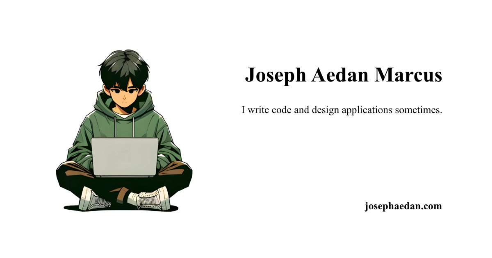

# Joseph Aedan Marcus's Portfolio Site



## Introduction

I am an aspiring software engineer who recently graduated from the National University of Singapore (NUS) with a Bachelor of Computing (Honours) in Computer Science. This is my portfolio site where I showcase my experiences and projects.


This portfolio follows a simplistic classic resume design with a focus on readability, accessibility and best SEO practices. The design is inspired from [Austin Z. Henley](https://austinhenley.com/index.html) and [bettermotherfuckingwebsite](http://bettermotherfuckingwebsite.com/).

## Technologies

This portfolio is made with [Astro](https://astro.build/) and hosted on [Vercel](https://vercel.com/) to allow for fast development and deployment with even faster performances. Each content is written in markdown and compiled using Astro's [Content Collection](https://docs.astro.build/guides/content-collections) feature for extensibility and type safety.

It also allows for an extensible [blog page](https://josephaedan.com/blog) by rendering all blog posts located in `src/content/blog`.

## Getting Started

### 1. Ensure that you have the following installed on your machine:

- [Node.js](https://nodejs.org/en/)
- [npm](https://www.npmjs.com/)

### 2. Clone the repository

```bash
git clone https://github.com/Josephaedan/Josephaedan.com.git
```

### 3. Install dependencies

```bash
npm install
```

### 4. Configure the environment variables

Create a `.env` file in the root directory and add the following:

```env
DEPLOYED_URL="http://localhost:3000"
```

An example of the `.env` file can be found in the `.env.example` file.

### 5. Start the development server

```bash
npm run dev
```
